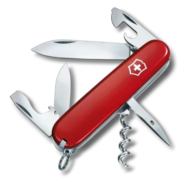

# gosak

A swiss army knife written in go



# Features
- Base64 decode
- Json format
- Get public ipv4
- Get domain SSL validity
- AWS assume role

# Download
```
VERSION=v0.0.2
OS=linux
ARCH=amd64
curl -sSL -o gosak https://github.com/tienvu461/gosak/releases/download/${VERSION}/gosak.${OS}.${ARCH}
chmod +x gosak
./gosak version
```

# Development

## ensure GOPATH is set
```
export GOPATH=$HOME/go
export PATH=$GOPATH/bin:$PATH
```
## install deps & cobra-cli
```
go get
go install github.com/spf13/cobra-cli@latest
```
## How to add new tool
- cd to project root
- Run the following command:
```
cobra-cli add <new-tool-to-gosak>
```

## Build
make -f build.mk clean
make -f build.mk build

## Release
1. Merge code to main: example [PR #13](https://github.com/tienvu461/gosak/pull/13) & verify CI
2. Checkout latest main & tag with sematic version (vx.y.z):
```
git checkout main
git pull origin main
git tag v0.0.1 -a
git push origin --tags
```
3. Verify CD and publish artifacts to [release page](https://github.com/tienvu461/gosak/releases/)

## Todo
- Test: Unit test
- Test: Compatability test with Windows/Linux/MacOS
- Feature: nslookup